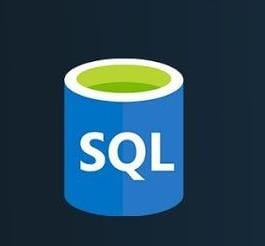
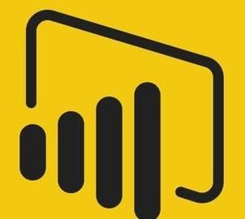
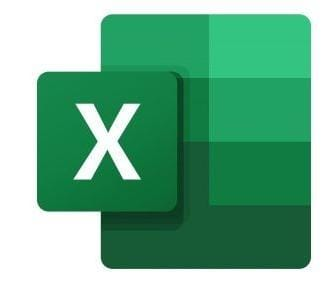

 

 **👋 Hello I’m mansi!**

I'm a passionate Data Analyst with a knack for turning data into actionable insights. With expertise in SQL, Python, Power BI, and Tableau, I enjoy diving deep into datasets to uncover patterns and trends that drive business decisions.

**🔍 What I Do**

Data Analysis & Visualization: Creating insightful dashboards and visual reports using Power BI, Tableau, and Excel.

Data Management: Proficient in SQL and Python for data cleaning, transformation, and analysis.

Business Insights: Leveraging data to provide strategic business insights and drive operational efficiency.

**📊 Featured Projects:**

ChatGPT Trends Analysis: An in-depth analysis of global ChatGPT usage trends using Tableau and Google Trends data.

Retail Insights Dashboard: Visualized key retail metrics from a sample superstore dataset, providing actionable insights into sales and customer behavior.

**🌱 Currently Learning:**

Advanced predictive analytics and machine learning techniques to enhance data-driven decision-making.

**💡 Let's Connect!**

I'm always open to discussing data, new opportunities, and innovative projects. Feel free to reach out or explore my repositories to see my work in action!

_________________________________________________________________________________________________________________________________________________________
**SKILLS**

                                      

<!---
maansiisp/maansiisp is a ✨ special ✨ repository because its `README.md` (this file) appears on your GitHub profile.
You can click the Preview link to take a look at your changes.
--->
